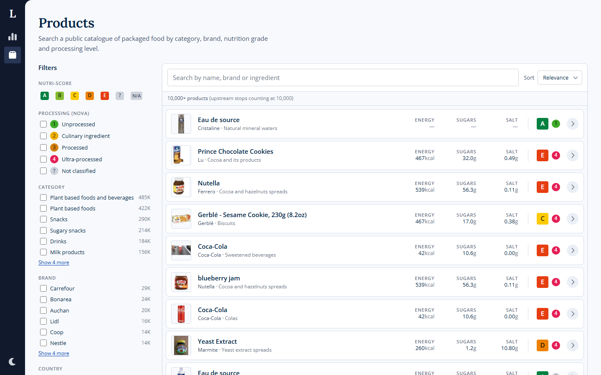
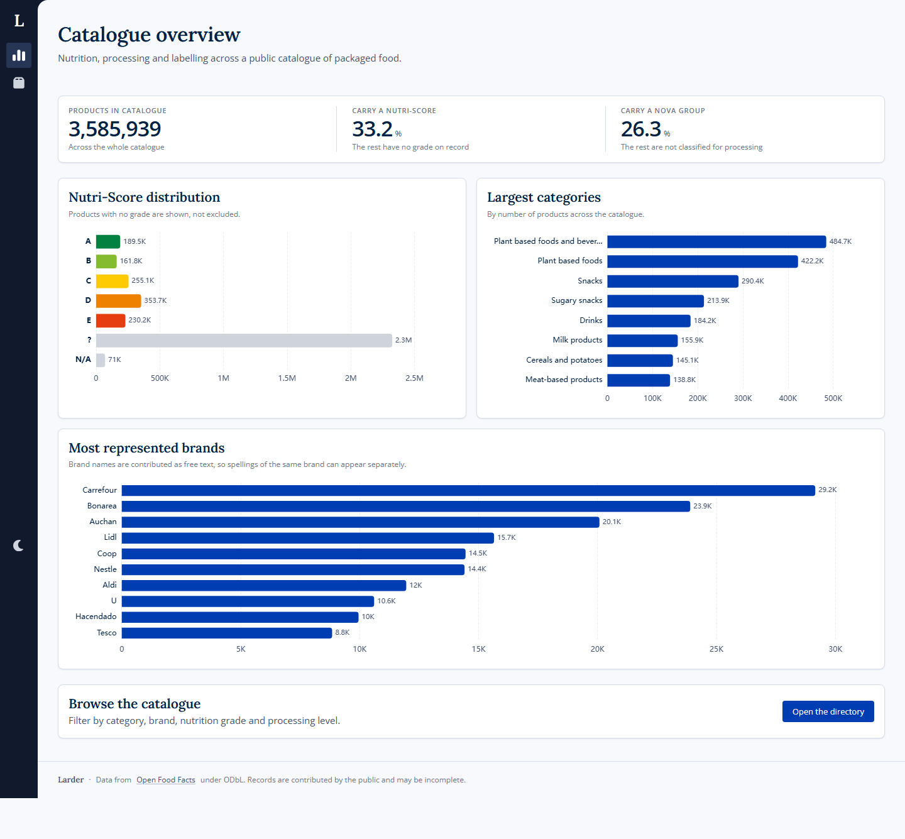
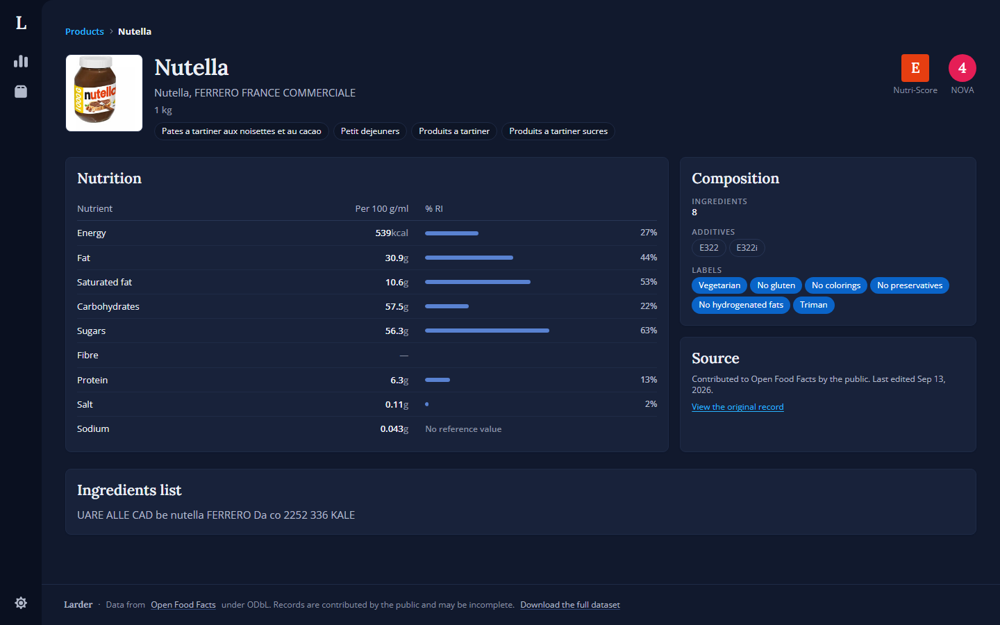

# Larder

A food product analytics dashboard on top of [Open Food Facts](https://world.openfoodfacts.org),
a public catalogue of roughly 3.5 million packaged products.

Filter the catalogue by category, brand, nutrition grade and processing level,
then open any product for its nutrition profile against EU reference intakes,
its additives, labels and provenance.

Nuxt 4, Vue 3.5, Tailwind 4, and a Nitro backend-for-frontend.



<details>
<summary>More screens</summary>

**Catalogue overview**



**Product deep dive, dark theme**



Regenerate with `pnpm run screenshots` against a production build.

</details>

---

## Setup

Node 24+ and pnpm.

```bash
pnpm install
pnpm dev
```

No API key or account. Open Food Facts is open data under
[ODbL](https://opendatacommons.org/licenses/odbl/).

---

## Why this data set

Open Food Facts is community-edited, so records are incomplete, fields
contradict each other across endpoints, and some entries are just wrong. That
was the point of picking it. Most of what is interesting in this repository
comes from handling that honestly instead of styling the happy path.

---

## Architecture

```
Browser
  │  URL is the filter state. No store, no sync.
  ▼
Vue components ── Pinia Colada ── app/api (typed client)
  │
  ▼
Nitro BFF  (server/api → server/services → server/upstream)
  │  Zod at the boundary, cache, retry, error mapping
  ▼
Open Food Facts  (two services, two contracts)
```

### The BFF

Every upstream call starts on the server. Three reasons, in order of weight:

1. Open Food Facts identifies callers by `User-Agent` and throttles anonymous
   traffic. A browser cannot set that header.
2. The two upstream services disagree about the same entity. `brands` is a
   comma-joined string from the v2 API and an array from the search index. No
   single client-side type models both.
3. A product document carries around 250 keys. A result row needs twelve.

All of it normalises into one contract in `shared/domain`, shared by the server
and the client.

### The domain comes first

`shared/domain` owes nothing to the upstream shape. Nutri-Score and NOVA are
defined by public health bodies; Open Food Facts is where they happen to be read
from. The schemas in `server/upstream` map _into_ the domain, never the reverse.

Two things fell out of that:

- **Nutrients are nullable per nutrient, not per product.** A product can declare
  sugars and omit fibre. One "has nutrition" flag would force the UI to render
  zeroes it cannot vouch for.
- **The contract splits into summary and detail.** The directory renders 24 rows
  needing a dozen fields each. The deep dive needs everything. Using one shape
  for both puts ~250 keys per row on the wire to draw a table.

### Filter state

The URL holds it. There is no store behind the directory and no watcher keeping
two copies in step, because either one creates a window where the address bar
and the results disagree.

One Zod schema parses the query string, the client call and the route handler,
so a shareable link and a valid API request are the same thing by construction.
Sharing, bookmarking and the back button then work with no code written for
them.

### Missing data

A nutrient nobody reported shows an em-dash, never a zero. In a community-edited
catalogue "not reported" and "none" are different facts, and a reader cannot
tell them apart afterwards. Unknown Nutri-Score and NOVA values work the same
way: they are states in the type, not errors to recover from.

---

## Design

### Colour

Nutri-Score runs green to red and NOVA runs green to red beside it, so that arc
of the wheel already means "grade" on every screen here. The accent is a deep
navy, picked by elimination: a blue bar reads as a quantity, a green-to-red
badge reads as a rating. Series colours are chosen for separation from the same
ramp, and the two nearest it come last in the order.

Everything else is cool, blue-cast grey. The dark theme is that same ramp read
from the other end, plus five steps it does not ship, each an OKLab
interpolation between two neighbours with the fraction recorded next to the
value. Nutri-Score and NOVA are excluded: their colours are set by regulation
and by a published classification, so tinting them to suit a theme would make
the badge misrepresent what it names. Each grade carries its own ink, because no
single ink clears WCAG AA across a green-to-red ramp.

### Type

Headings are [Lora](https://fonts.google.com/specimen/Lora), everything a reader
scans or compares is [Open Sans](https://fonts.google.com/specimen/Open+Sans).
The pairing marks where a page begins without needing a rule or a coloured band.
Figures stay sans and tabular: Lora's numerals are old-style and a column of
them cannot be compared. An end-to-end test asserts both.

### The UI layer

`layers/ui` is a Nuxt layer, not a folder, so the boundary is enforced by the
module graph.

It holds values, never meaning. It knows there is a surface, an ink, a series
colour and a token spelled `--nutriscore-a`, the same way a stylesheet does, and
nothing in it imports from `shared/domain`. The question before moving a
component down into it is "does this file name a concept from the problem
domain". A badge typed on `NutriScore` fails that; the panel it sits on passes.

Tokens go primitives → semantics → domain, and only the semantic tier is
redefined for dark mode. `@theme inline` emits the custom property into each
utility instead of its computed value, so one `.dark` block reskins the app with
**no `dark:` variants in any template**. Charts read the same tokens at runtime,
so there is no second palette in TypeScript to drift.

---

## Things that went wrong

Each is documented at the point in the code where it matters. Upstream findings
are collected in [`docs/upstream-api.md`](docs/upstream-api.md).

**The query parser fails silently.** Upstream parses `q` as a Lucene expression.
Unescaped input does not raise an error, it changes meaning and returns zero
matches. A product whose name contains a colon would appear not to exist, with
nothing saying why. Values are escaped the way SQL values are, in
`server/utils/lucene.ts`, and the injection case is under test.

**Tailwind was not scanning the layer.** Class names are discovered from the
Vite root, which Nuxt sets to the app directory, so everything under `layers/`
fell outside the scan and every utility used only in the design system was never
generated. `bg-nutri-a` computed to transparent while `bg-surface-raised`, which
the app also used, was fine. The class was in the markup, the token resolved,
the build succeeded, and lint, types and the unit suite all passed. Fixed with
an explicit `@source`, and `e2e/design-tokens.spec.ts` now asserts the utilities
resolve in a real browser.

**Two numbers describing different populations.** Elasticsearch stops tracking
hits at 10,000 but still aggregates over every matching document, so `count` is
a ceiling while facet counts are real totals. The overview was reading one for
its headline and the other for its charts, putting 10,000 and 3.5 million on one
screen as if they measured the same thing. The directory renders an inexact
total as "10,000+" for the same reason.

**"Other" is not a category.** The facet response includes a `--other--`
remainder bucket holding the long tail. It cannot be filtered on, and being a
sum it outweighs every real value. Left in, the category chart reported Other as
the largest category of food in the world, at six million products.

**The two services disagree about names.** Barcode `3274080005003` is "Eau de
source" in the search index, "Cristaline" in the product API, and carries
"isabelle" in a third field. A directory card and the page it opens are allowed
to differ. Picking "whichever looks most like a product name" is a heuristic
over vandalism, so one rule is applied consistently, the divergence is
documented, and the end-to-end test asserts the barcode instead of the heading.

**Zod 4 needs the key to be present.** Upstream omits a key entirely when it has
no value, and a union that merely includes `z.undefined()` still requires the
key. Every record missing any optional field was rejected, which is most of the
catalogue: the directory rendered empty while reporting 10,000 matches. Found by
writing the test with a fixture copied from a real response instead of an
invented one.

**Upstream's multi-taxonomy autocomplete is unusable.** `/autocomplete` accepts
a list of taxonomies, and ranks the whole list together, so the highest-scoring
one fills the response: "choc" across categories, brands and labels comes back
as eight brands and no category at all. The BFF issues one call per taxonomy and
interleaves them with a quota, which is why the search box can suggest a
category and a brand in the same list.

**Filters could not be switched off.** The URL writer merged two serialised
queries, and the serialiser omits anything at its default, including an empty
list. A patch that emptied a dimension carried no key for it, so the old value
survived the merge. Applying a filter worked; unchecking one did nothing, and
neither did Clear all. Every test applied a filter and none removed one, so the
suite stayed green.

---

## Accessibility

- **Charts render their figures as a visually hidden table.** A canvas is
  unreadable to a screen reader and to anyone who cannot separate the colours.
  Alt text saying "bar chart" is not an accessible chart.
- **Nutri-Score and NOVA never rely on colour alone.** The scale runs green to
  red, exactly the pair a red-green deficiency collapses, so the letter or
  number always renders and the accessible name spells out the scale.
- Filter changes are announced politely instead of silently replacing results.
- `prefers-reduced-motion` suppresses the skeleton pulse and every transition.
- The theme is applied by a blocking inline script before first paint, so a
  dark-mode reader never gets a white flash.

---

## Testing

```bash
pnpm run lint        # ESLint (formatting is Prettier's alone)
pnpm run typecheck   # vue-tsc
pnpm run test        # Vitest, 274 specs
pnpm run e2e         # Playwright, 37 specs, against a production build
pnpm run ci          # lint, types, and unit tests with coverage
```

The suites divide by what they can see. Vitest covers the domain, services,
mappers and URL state, with the coverage threshold set at the measured figure
floored to the whole number, so losing a test fails the run.

Playwright owns what only a browser can answer: whether a Tailwind utility
resolves, whether a chart's hover state renders, whether a tree hydrates
cleanly. All three have broken here at some point, and a jsdom render sees none
of them, which is why `.vue` files sit outside the coverage target.

---

## Layout

```
shared/domain/     Domain model. Knows nothing about any API.
server/
  api/             Route handlers. Transport and caching only.
  services/        Search, lookup and suggest as plain functions.
  upstream/        Upstream schemas and the mapping into the domain.
  utils/           HTTP client, Lucene builder, error mapping, cache policy.
app/
  api/             Typed client for our own API.
  composables/     URL-backed filter state, queries, the domain palette.
  components/
    chrome/        Navigation rail. The frame, not the content.
    product/       Everything that knows what a product is.
  pages/           Overview, directory, product deep dive.
layers/ui/         Design system. Tokens, primitives, formatting, chart theme.
test/              Unit specs, mirroring the tree above.
e2e/               Playwright specs.
docs/              Upstream API findings.
```

---

## Dependency notes

**ECharts over Highcharts.** Highcharts is excellent and its licence is
commercial. Apache-2.0 keeps this repository unambiguously reusable.

**Pinia Colada over `useFetch`.** The directory refetches on every filter
change, and most of those are a user toggling something off and back on. A cache
keyed on the query turns that into no request, and deduplicates the burst a fast
typist generates.

**No headless library for the select.** `appearance: base-select` styles the
open picker while the element stays a real `<select>`, so keyboard navigation,
type-ahead, form association and the touch picker all keep working. Chrome and
Edge ship it, Firefox has it behind a flag and Safari in Technology Preview;
elsewhere the closed control is still styled and only the open list falls back
to the platform's own.

**No image proxy.** Open Food Facts renders every photograph at 100, 200 and
400 pixels and serves them from its own CDN, so the elements carry a `srcset`
over those and the browser picks by device pixel ratio. Running them through
`@nuxt/image` and IPX instead would add a hop, move the bandwidth onto this
server and lose upstream's caching, to arrive at files upstream had already
made.

**TypeScript pinned to 6.0.3.** typescript-eslint declines to load against
TypeScript 7 (supported range `>=4.8.4 <6.1.0`), a transitive Nuxt dependency
pulls 7 in, and pnpm's isolation meant the parser resolved that copy and failed
the whole lint run even after the direct dependency was downgraded. A pnpm
override pins one compiler across the graph. Revisit when typescript-eslint
supports 7.

---

## Limitations

Things a reviewer would find, listed so nobody has to.

- **English only.** The locale is fixed in `layers/ui/app/utils/format.ts`, while
  the catalogue is multilingual and mostly European. Switching separators without
  translating anything would be worse than leaving them.
- **No deployment.** Upstream is rate limited and shared, and a public instance
  would need a caching tier and a real contact address in the `User-Agent` before
  it would be a good citizen.
- **The list is not virtualised.** Page size caps at 96, which is fine at that
  size and would not be at 1,000.
- **A product name can differ between a card and the page it opens.** Upstream
  disagreement, described above. Not fixable from here.
- **`useProductSearch` and `useTheme` have no unit tests.** Both are thin
  wrappers over Pinia Colada and VueUse, and covering them would mostly assert
  that those libraries work. They are exercised end-to-end.

---

## Licence

Code under MIT. Product data belongs to Open Food Facts contributors under ODbL
and is fetched live. None of it is redistributed here.
