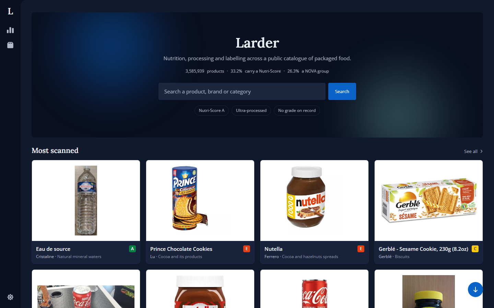

# Larder

A food product analytics dashboard on top of [Open Food Facts](https://world.openfoodfacts.org), a public catalogue of roughly 3.5 million packaged products.

Filter the catalogue by category, brand, nutrition grade and processing level, then open any product for its nutrition profile against EU reference intakes, its additives, labels and provenance.

Nuxt 4, Vue 3.5, Tailwind 4, and a Nitro backend-for-frontend.


<details>
<summary>More screens</summary>

**Front page, dark theme**



**Catalogue overview**


**Product deep dive, dark theme**


Regenerate with `pnpm run screenshots` against a production build.

</details>

---

## Setup

Node 24+ and pnpm. No API key or account.

```bash
pnpm install
pnpm dev
```

---

## Why this data set

Open Food Facts is community-edited, so records are incomplete, fields contradict each other across endpoints, and some entries are just wrong. That was the point of picking it. Most of what is interesting in this repository comes from handling that honestly instead of styling the happy path.

Two thirds of the catalogue has no Nutri-Score, for two different reasons. A beer is excluded by the scheme and never will have one; a yoghurt nobody has graded might have one tomorrow. They are separate values, separate badges, separate bars and separate filters here, because collapsing them would report a deliberate exclusion as missing data.

---

## Screens

| Route                | What it is                                                               |
| -------------------- | ------------------------------------------------------------------------ |
| `/`                  | Front page: search, three example filters, the products people scan most |
| `/overview`          | The shape of the whole catalogue, as charts                              |
| `/products`          | The directory: facets, sort, page size, pagination                       |
| `/products/:barcode` | One product: nutrition against EU reference intakes, composition, source |

---

## How it is built

- **A BFF, not a proxy.** Nitro routes talk to two upstream services with different engines and contradictory shapes, and hand the client one contract it can trust. Every response is parsed with Zod at the boundary.
- **The domain comes first.** `shared/domain` owes nothing to the upstream shape. Nutri-Score and NOVA are defined by public health bodies, not by the API we happen to read them from.
- **Filter state lives in the URL.** No store, no two-way watcher. Sharing, bookmarking and the back button work with nothing written for them.
- **The export streams, and cannot end quietly.** `/api/products.csv` reads the directory's own query string, so the link is built from the URL alone and works before any JavaScript runs. Rows are written as upstream pages arrive, up to the 10,000 the search index will page to. A reader who cancels stops the upstream requests, and a failure halfway cuts the connection instead of closing the file, so a partial export cannot pass for a whole one.
- **Missing data is a value, never a zero.** A nutrient nobody reported shows an em-dash; a product with no photograph gets a tile that says so.
- **The design system is a Nuxt layer**, and the boundary is enforced rather than agreed: nothing under `layers/ui` imports from the domain or knows that food is being catalogued at all.
- **One theme, read from tokens.** Components use semantic utilities and charts read the same custom properties at runtime, so a colour is never written twice. The handful of `dark:` variants left are for what a colour token cannot say: which of two icons is drawn, and how strong a decorative wash should be.

---

## Testing

```bash
pnpm run ci    # format, lint, types, and the unit specs with coverage
pnpm run e2e   # Playwright across two viewports, on a production build
```

The suites divide by what they can see. Vitest covers the domain, services, mappers and URL state. Playwright owns what only a browser can answer: whether a Tailwind utility resolves, whether a chart's hover state renders, whether a tree hydrates cleanly. All three have broken here at some point, and a jsdom render sees none of them.

---

## Reading further

[docs/upstream-api.md](docs/upstream-api.md) compares the two upstream contracts, gathered by probing the live services, because the published documentation lags behind them and they disagree with each other.

Everything else is documented where it applies: a trap is a comment on the line that works around it, and the reasoning behind a change is in the commit that made it.

---

## Licence

Code under MIT. Product data is Open Food Facts', under [ODbL](https://opendatacommons.org/licenses/odbl/); attribution is rendered on every page that shows it, and every exported row links to the record it came from.
