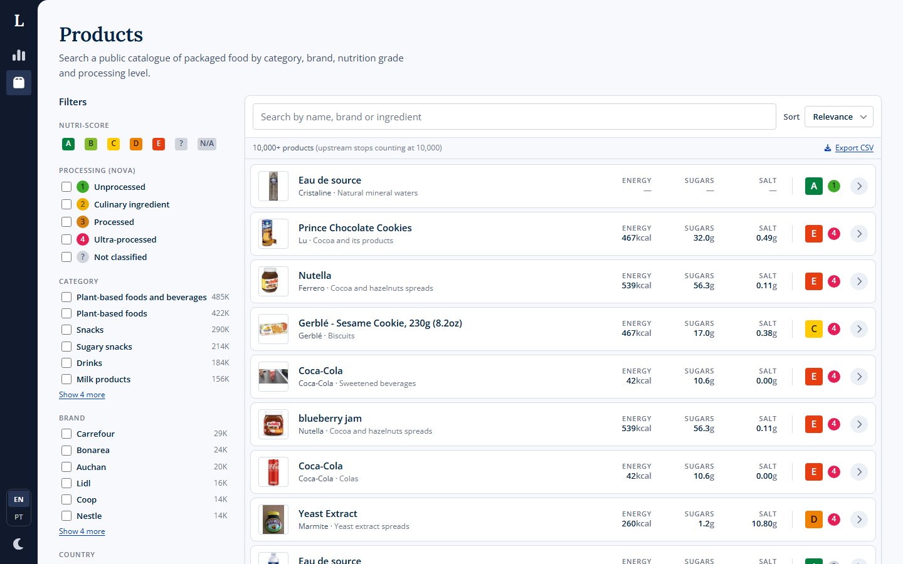
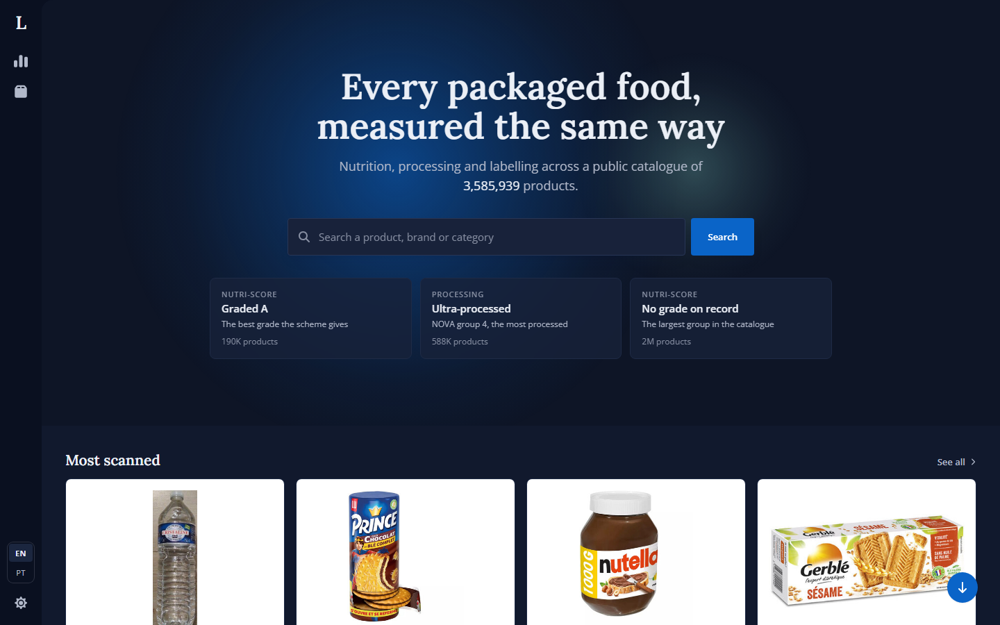
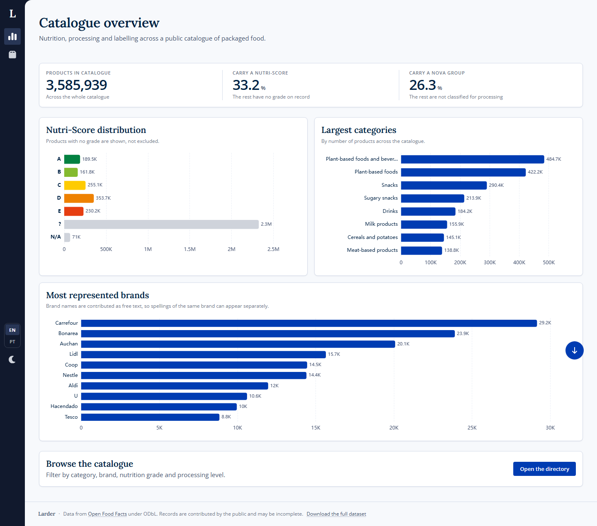
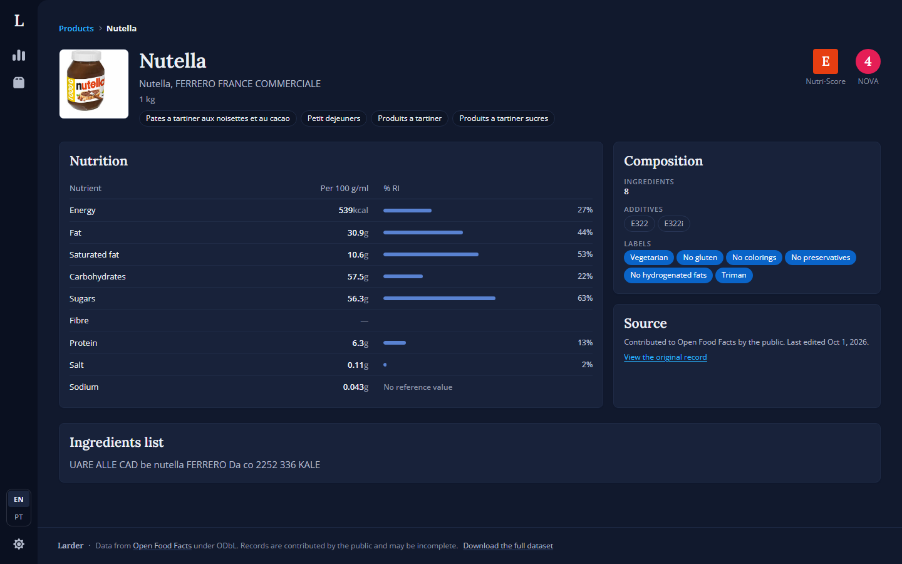
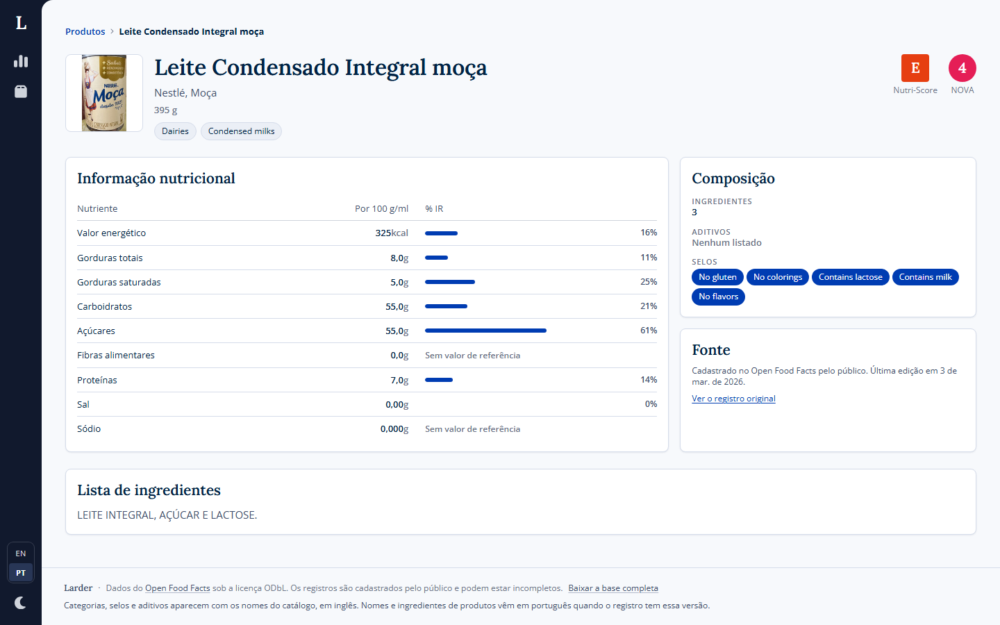
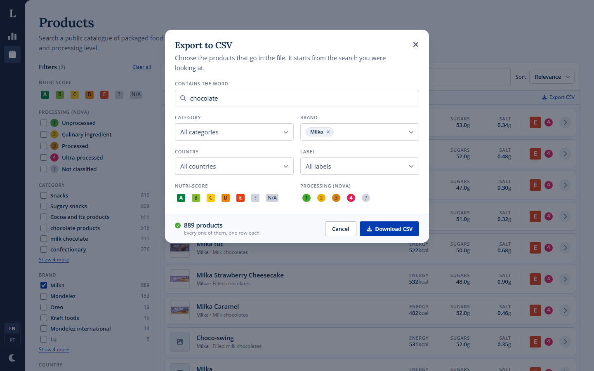
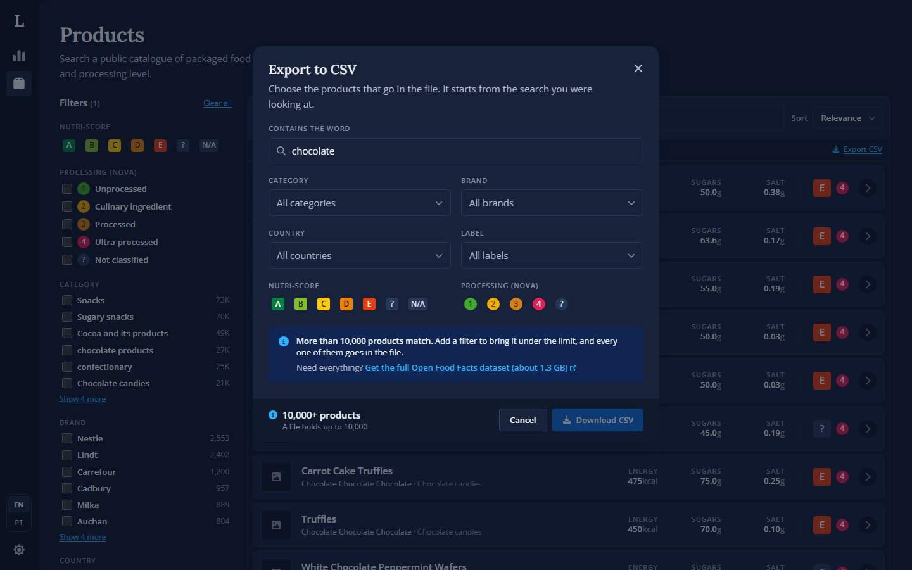

# Larder

A food product analytics dashboard on top of [Open Food Facts](https://world.openfoodfacts.org), a public catalogue of roughly 3.5 million packaged products.

Filter the catalogue by category, brand, nutrition grade and processing level, then open any product for its nutrition profile against EU reference intakes, its additives, labels and provenance.

In English, and in Brazilian Portuguese under `/pt`.

Nuxt 4, Vue 3.5, Tailwind 4, and a Nitro backend-for-frontend.



<details>
<summary>More screens</summary>

**Front page, dark theme**



**Catalogue overview**



**Product deep dive, dark theme**



**The same page in Brazilian Portuguese**



**Export, narrowed from a dialog**



**Export past the 10,000 limit, dark theme**



Regenerate with `pnpm run screenshots`, which builds the app, serves it to itself and captures every screen from the live catalogue.

</details>

---

## Setup

Node.js 22.13 or newer and pnpm. No API key or account.

```bash
pnpm install
pnpm dev
```

`pnpm storybook` opens the design system on its own: the tokens, every component in the layer, and the badges, nutrient table and charts of a product, drawn from real catalogue figures in both themes.

The scripts run on Node.js 24, pinned in `package.json` under `devEngines` and downloaded on the first install.

Served from anywhere but `http://localhost:3000`, set `NUXT_PUBLIC_I18N_BASE_URL` to that address, so each page links its other language by a whole URL.

---

## Why this data set

Open Food Facts is community-edited, so records are incomplete, fields contradict each other across endpoints, and some entries are wrong. Most of what is interesting here comes from handling that honestly instead of styling the happy path.

Two thirds of the catalogue has no Nutri-Score, for two different reasons: a beer is excluded by the scheme, while a yoghurt nobody has graded might have one tomorrow. They stay separate values, badges and filters, because collapsing them would report a deliberate exclusion as missing data.

---

## Screens

| Route                | What it is                                                               |
| -------------------- | ------------------------------------------------------------------------ |
| `/`                  | Front page: search, three example filters, the products people scan most |
| `/overview`          | The shape of the whole catalogue, as charts                              |
| `/products`          | The directory: facets, sort, page size, pagination                       |
| `/products/:barcode` | One product: nutrition against EU reference intakes, composition, source |

Each one is also under `/pt`, in Brazilian Portuguese.

---

## How it is built

- **A BFF, not a proxy.** Nitro routes read two upstream services with contradictory shapes and hand the client one contract, parsed with Zod at the boundary.
- **The server compresses for itself.** Nothing stands in front of it, so pages and answers go out in brotli or gzip as they are written, and the build ships its scripts and styles already packed. That nearly halved every page's LCP on the emulated phone.
- **The domain comes first.** `shared/domain` owes nothing to the upstream shape: Nutri-Score and NOVA follow the public health bodies that define them.
- **Filter state lives in the URL.** No store and no watcher, so sharing, bookmarking and Back work for free.
- **An export holds every match, or it does not happen.** The search index stops at 10,000 rows, so a larger search asks for one more filter instead of saving an arbitrary slice. The CSV streams as upstream pages arrive, and a failure halfway cuts the download, so a partial file never passes for a whole one.
- **The dialog is the platform's own.** A native `<dialog>` keeps the page inert and returns focus, and its pickers are popovers placed with CSS anchor positioning, with no library for either.
- **Two languages, one address each.** Nothing redirects by the browser's language, so a shared link opens in the language it was sent in, and numbers and dates follow the page: 3,585,939 or 3.585.939. The catalogue's own Portuguese is European and uneven, so countries are named from CLDR, product names and ingredients are Portuguese only where a record has them, and categories, labels and additives keep their English names, which every Portuguese page says.
- **Missing data is a value, never a zero.** A nutrient nobody reported shows a dash, and a product with no photograph says so.
- **Loading claims nothing and moves nothing.** A product page waits in a skeleton built line for line like its header, instead of saying "none" before the record has spoken, so the record lands without moving what is below it. It does not open with the list's copy of the product: the search index stopped in December 2024 and disagrees with the record on most products.
- **The design system is a Nuxt layer**, and its boundary is enforced: nothing under `layers/ui` knows that food is being catalogued.
- **One theme, read from tokens.** Components and charts read the same custom properties, so a colour is never written twice.

---

## Testing

```bash
pnpm run ci               # format, lint, types, and unit tests with coverage
pnpm run storybook:test   # every story in both themes, its interactions played and audited by axe
pnpm run e2e              # Playwright on desktop and mobile, against a production build
pnpm run vitals           # the Core Web Vitals of each page, against a production build
```

Vitest covers the domain, services, mappers and URL state. Playwright covers what only a browser can: whether a Tailwind utility resolves, whether a chart renders its hover state, whether the page hydrates cleanly, and whether every page, whole, passes axe in both themes. The story checks put each component on its own, so a contrast or labelling fault shows on the component that has it, not on whichever page happens to render it.

Every push also measures LCP, CLS and INP on the phone and connection Lighthouse emulates for mobile, against Open Food Facts as it answered once, and fails when a page measures worse than its baseline. The recording keeps the catalogue's latency out of the numbers; `pnpm run vitals:record` takes a new one.

<!-- web-vitals -->

| Page           | LCP    | CLS   | INP   |
| -------------- | ------ | ----- | ----- |
| The front page | 1.60 s | 0.036 | 40 ms |
| The directory  | 1.65 s | 0.003 | 40 ms |
| The overview   | 1.59 s | 0.005 | 24 ms |
| A product page | 1.68 s | 0.018 | 24 ms |

Measured on 7 October 2026, the median of two runs in CI ([1](https://github.com/christianchiavelli/larder/actions/runs/37565763875), [2](https://github.com/christianchiavelli/larder/actions/runs/37566377530)).
<!-- /web-vitals -->

---

## Reading further

[docs/upstream-api.md](docs/upstream-api.md) compares the two upstream contracts, probed live, because the published documentation lags behind them. The reasoning behind each change is in the commit that made it.

---

## Licence

Code under MIT. Product data is Open Food Facts', under [ODbL](https://opendatacommons.org/licenses/odbl/); attribution is rendered on every page that shows it, and every exported row links to the record it came from.
